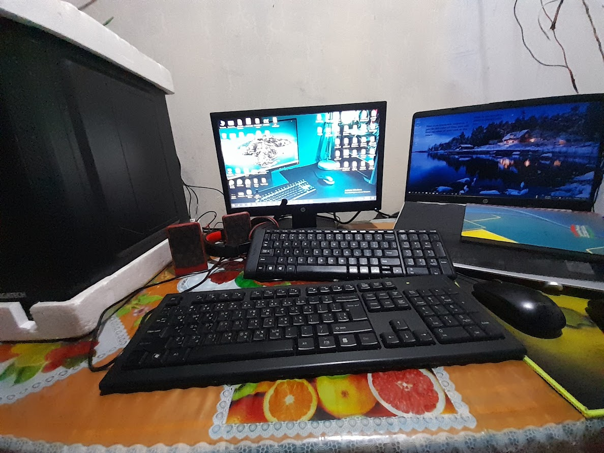

## Hello! Welcome to my GitHub Profile 👋

I'm Jillu Rahman Jibon, a junior Web Developer from  Bangladesh. I Spend most of my time coding outstanding projects.

:coffee: &emsp;Connect with me!

      

:hearts: &emsp;I enjoy programming and sharing knowledge  
:computer: &emsp;Most used line of code `console.log("hello world")`  
🤔 &emsp; I’m looking for people who can help me with Outstanding Video ideas and executions. 
:e-mail: &emsp;How to reach me: jillurahmanjibon@gmail.com. 

#### 🚀 Tech Stack I Use

        
       

 
